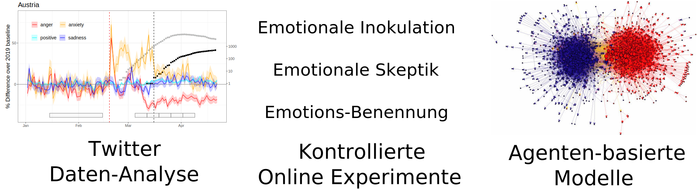

```{r xaringan-themer, include=FALSE, warning=FALSE}
# #This block contains the theme configuration for the CSS lab slides style
library(xaringanthemer) #
library(showtext)
style_mono_accent(
  base_color = "#1f5c99",
  text_font_size = "1.5rem",
  header_font_google = google_font("Raleway"),#("Yanone Kaffeesatz"),
  text_font_google   = google_font("Arial", "300", "300i"),
  code_font_google   = google_font("Fira Mono")
)
```

```{r setup, include=FALSE}
options(htmltools.dir.version = FALSE)
```


layout: true

---
class: inverse, center, middle, title-slide

# Emotionen und die Verbreitung von Falschinformationen
## Hannah Metzler
### Complexity Science Hub Vienna
### 18.11.2021 @ Vienna Art Week: Losing Control Line-Up
<!-- ### Folien: www.hannahmetzler.eu/viennaartweek -->

---

layout: true
<div class="my-footer"><span>
<a href="https://doi.org/10.1126/science.aao2998">Lazer et al. (2018). The science of fake news. </a></span></div>

---

# Was sind Falschinformationen?

.left-column[
<br><br><br><br>
```{r, echo=FALSE, out.width=500, fig.align='center'}
knitr::include_graphics("figures/fake-news-3801637.svg")
```
]
.right-column[
**Widersprechen allgemein anerkannten & überprüfbaren Fakten**

* Unabhängig von Täuschungsabsicht <br>

* Verzerrte/einseitige Information <br>

* Fake News <br>

* Verschwörungserzählungen & Mythen
]

---
layout: true
<div class="my-footer"><span>
<a href="https://doi.org/10.35650/MD.2063.d.2020"> Starbird et al. (2020). Misinformation, Crisis, and Public Health - Reviewing the
Literature. </a></span></div>

---

# Bedrohung für unsere Gesellschaft?

* Vertrauen in Politik, Demokratie und Wissenschaft
* Gesellschaftlicher Zusammenhalt

* Gesundheit: Beispiel Pandemie
      * Impfbereitschaft
      * Maßnahmen einhalten
      * Soziale Konflikte (Freundschaftskreis, Familie)

<!-- * Politische Konflikte:  -->
<!--   * Beispiel Wahlen USA: Sturm auf das US Kapitol -->

---
layout: true
<div class="my-footer"><span>
<a href="https://doi.org/10.1177/1750698017701615"> van Prooijen & Douglas (2017).</a> 
<a href="https://doi.org/10.1177/1948550620934692"> Imhoff & Lamberty (2020). </a> 
</span></div>

---

# Warum Emotionen?

* Krisenzeiten: Anstieg von Falschmeldungen & Mythen
    * Gefühl von Machtloskigkeit und Kontrollverlust
    * Verstehen wollen: Unsicherheit reduzieren
    
* Illusion von Kontrolle und Verstehen durch Falschinformationen
    
* Informationsflut: Emotion entscheidet, was wir wahrnehmen

* Bessere Erinnerung an emotionale Ereignisse


---
layout: true

---

# Einstellungen sind sozial motiviert

* Gefühl von Identität

* Zugehörigkeit zu einer Gruppe

* Kognitive Verzerrungen: Wir glauben eher, was uns bestätigt

* Bedrohung: Defensive

* Fakten reichen oft nicht, um Einstellungen zu ändern

---

# Soziale Medien & Falschinformation

* Warum nützen wir soziale Medien?

  * Unterhaltung
  * Sozialer Austausch
<!-- * Nicht zur kritischen Bewertung von Information -->

* Algorithmen zielen auf **Emotion** um Aufmerksamkeit zu maximieren <br>
* **Emotion** zieht Aufmerksamkeit an und löst schnelle Handlungen aus <br>
* **Emotion** verhindert kritische Reflektion <br>

    * Sensationelle News haben die besseren Karten
    * Fake news nützen das aus

---
layout: true
<div class="my-footer"><span>
<a href="https://doi.org/10.1016/j.tics.2021.02.007"> Pennycook & Rand (2021).The Psychology of Fake News. </a></span></div>

---

# Bisherige Lösungen

.left-column[
```{r, echo=FALSE, out.width=350, fig.align='center'}
knitr::include_graphics("figures/factchecking.jpeg")
```
]

.right-column[.center-right[
**Fokus auf Richtigkeit der Information**

* Fact checking

* Warnhinweise in sozialen Medien

* Durch Erklärung gegen Falschinformation impfen: Inokulation
]]


---
layout: true
<div class="my-footer"><span>
<a href="https://doi.org/10.1186/s41235-020-00252-3"> Martel et al. (2020) Reliance on emotion promotes belief in fake news.  </a></span></div>

---


# Lösungen, die Emotionen berücksichtigen

**Menschen sind SEHR soziale Wesen**

* Emotionen gehören in jeder sozialen Interaktion dazu

* Emotionen erhöhen Glaube und Teilen von Falschinfos

* Können wir direkt emotionale und soziale Beweggründe ansprechen?

* Können individuelle Interventionen trotz emotionaler Algorythmen effektiv sein?

---
layout: true

---

# WWTF Projekt Emomis
## Emotionale Verbreitung von Falschinformationen


```{r, echo=FALSE, out.width=1200, fig.align='center'}

```

---

# Literatur Empfehlungen

*  [Ingrid Brodnig (2020): Einspruch! Verschwörungsmythen und Fake News kontern - in der Familie, im Freundeskreis und online](https://www.brandstaetterverlag.com/buch/einspruch/), Verlag: Brandstätter. 

* [ Katharina Nocun & Pia Lamberty (2020): Fake Facts - Wie Verschwörungstheorien unser Denken bestimmen](https://www.luebbe.de/quadriga/buecher/gesellschaft/fake-facts/id_7818123), Verlag: Quadriga. <br><br>


**DANKE!**

```{r, echo=FALSE, out.width=400}
knitr::include_graphics("figures/wwtf.svg")
```
```{r, echo=FALSE, out.width=300}
knitr::include_graphics("figures/csh.png")
```
